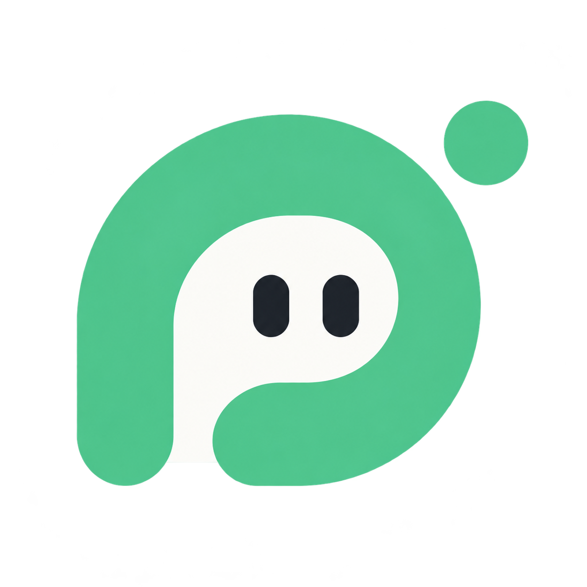

  

<h1 align="center">풀다 · Pulda</h1>

  내 말을 전하고, 진료 내용을 이해하고, 다음 할 일을 확인하는 
  <strong>농인을 위한 AI 진료 동행 서비스</strong>

  <a href="https://pu-47f72605b46140b3aa470e8dd3c40a31.ecs.ap-southeast-2.on.aws">풀다 이용하기 →</a>

## 왜 만들었나요?

병원에서는 증상을 설명하고, 빠르게 오가는 대화를 따라가고, 낯선 의료 용어와 안내를 기억해야 합니다. 음성 중심의 진료 환경에서는 이 과정에 필요한 정보를 놓치거나, 궁금한 점을 충분히 묻지 못할 수 있습니다.

풀다는 **내가 전할 말부터 진료 후 해야 할 일까지 끊기지 않도록** 만들었습니다. 사용자가 자신의 진료에 직접 참여할 수 있게 글과 AI로 소통을 돕습니다.

## 이렇게 함께합니다

- **병원에 가기 전** — 필요한 진료에 맞는 병원을 찾고, 전화·문자로 문의할 내용을 준비합니다. 증상과 질문, 접수할 때 필요한 도움도 미리 정리합니다.
- **진료를 받는 동안** — 실시간 자막과 필담으로 대화를 이어갑니다. 준비한 말은 큰 글씨로 보여줄 수 있습니다.
- **진료를 마친 뒤** — 대화와 안내문을 바탕으로 안내받은 내용과 다음 할 일을 정리합니다. 안내가 서로 다르면 다시 물어볼 내용을 준비하고, 확인한 일정을 챙깁니다.

## 풀다에 담은 생각

**한 번에 한 가지씩.** 한 화면에 정보를 쌓기보다, 지금 필요한 내용을 보고 다음 행동을 선택하도록 구성했습니다.

**내 말의 의미를 지키는 AI.** 전달할 문장을 다듬고 진료 내용을 정리하되, 원문과 출처를 함께 확인할 수 있게 했습니다.

**결정은 내가 직접.** 문의할 내용과 일정 변경은 사용자가 확인합니다. 서로 다른 안내는 AI가 정답을 고르는 대신, 병원에 확인할 수 있도록 돕습니다.

풀다는 의료진의 진단·치료 판단이나 수어통역을 대신하지 않습니다. 글로 소통하고 정보를 확인하는 데 도움을 주는 서비스입니다.
